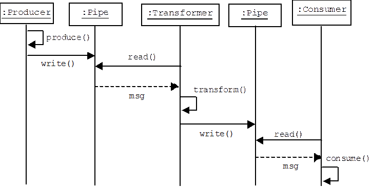

<!-- page_number: true -->
<!-- $size: b2 -->
<!-- $theme: gaia -->

# Getting the word out in ==realTime==

###### Building a message processing pipeline using Gevent, Redis and NginxPushStreamModule in Python

###### []


###### Created by [Rahul Gaur (@aregee)](https://github.com/aregee)

---

## Why do ==realTime==?


- getting new data to user asap.

- for increased engagement.

- reaching users even when they are not on your website

- realtime heatmaps and analysis of activity or engagement on post


---

<!-- *template: gaia -->

## Architecture overview!!


---
##### Platform
<!-- $size: b2-->
- Python & Flask
- Thoonk Redis Queue - a queue library on top of redis.
- Nginx Push Stream Module - A pure stream http push technology for your Nginx setup.
- *Gevent - coroutine-based Python networking library that uses greenlet to provide a high-level synchronous API on top of the libev event loop.*
- Long Polling using EventSource (in the browser) or use webSocket


---

Motivation for realtime
==

- Engagement. Realtime distribution of comments encourages users to stay on a page longer. More people comment after realtime than they did before.

- Sell/trade data. Create a fire-hose product out of the global comment stream.

---


---
<!-- *template: invert -->

>
> The **actor** model in computer science is a mathematical model of **concurrent computation** that treats **actors** as the universal primitives of concurrent computation.
>
> <small>-- *[Actor Model (computer science) - Wikipedia, the free encyclopedia](https://en.wikipedia.org/wiki/Actor_model)*</small>

---


## Actors


- The actor model is a higher level concurrency model popularized by the language Erlang.

- The idea is that you have a collection of independent Actors which have an inbox from which they receive messages from other Actors.

- The main loop inside the Actor iterates through its messages and takes action according to its desired behavior.


---


## How to implement an ==Actor== <br> using Gevent  !

##### *Gevent does not have a primitive Actor type, but we can define one very simply using a Queue inside of a subclassed Greenlet.*. :laughing:

---
```python
class Actor(gevent.Greenlet):
	def __init__(slef):
    	self.inbox = Queue()
    	Greenlet.__init__(self)
    def receive(self, message):
        """
        Define in your subclass.
        """
        raise NotImplemented()

    def _run(self):
        self.running = True

        while self.running:
            message = self.inbox.get()
            self.receive(message)

```
---
<!-- $size: 4:3 -->
```python
class Pinger(Actor):
    def receive(self, message):
        print(message)
        pong.inbox.put('ping')
        gevent.sleep(0)

class Ponger(Actor):
    def receive(self, message):
        print(message)
        ping.inbox.put('pong')
        gevent.sleep(0)

ping = Pinger()
pong = Ponger()

ping.start() # ping.inbox.put('start')
pong.start() # gevent.joinall([ping, pong])
```

---
<!-- *template: invert -->
- Uses a pipelined architecture where messages pass from queue to queue while being acted upon by filters.

- Using nginx + push stream module. This replaced redis pub/sub, flask servers.

- Flow looks like: New Posts -> ApiServer -> redis queue ->  “python glue” Gevent formatting server -> http post -> nginx pub endpoint -> nginx + push stream module <- clients

- Caveats
	- Network memory limitations in the kernel.
	- It’s a socket allocation problem, that is having lots of sockets open.

---
### Pipeline
<!-- template: default -->



---
<!--$size: b2-->
#### Pipelined architectures.

- The python glue program is structured as a data pipeline, there are stages the data must go through: parsing, computation, publish it to another place. These are run in a greenlet.

- Mixins were used to implement stage functionality: JSONParserMixin,  AnnomizeDataMixin, SuperSecureEncryptDataMixin, HTTPPublisher, FilePublisher.

- The idea is to compose pipelines. A message would come off of thoonk and run through a pipeline: JSONAnnonHTTPPipeline, JSONSecureHTTPPipeline, JSONAnnonFilePipeline.

- Pipelines can share most of their functionality, yet still be specialized. Great when bringing up a new feature you can make a new pipeline stage, make a new pipeline, and have the old pipeline run side by side with the new pipeline. Old and new features happily coexist.

- Tests are also composable within a pipeline. To run tests just insert a filter/module/mixin in the pipeline and the tests will get run.

- Easy to reason about. Each mixin is easy to understand. It does one thing. New engineers on a project have a much easier time groking a system designed this way.

---
#### Pipeline Base
```python
class Pipeline(gevent.Greenlet):

    def __init__(self, name, queue):
        # listen to thoonk qeue list here
        self.ps_all = time.time()
        self.queue = queue
        self.inbox = app._pubsub.queue(self.queue)
        self.drafts = app._pubsub.queue('backlogs')
        self.name = name
        Greenlet.__init__(self)

    def receive(self, name, task):

        print("Worker %s recived task %s" % (name, task))

    def handle(self, data):

        raise NotImplemented('No handle Mixin')

```
---
```python

    def _run(self):
	    self.running = True

    while self.running:
      try:
        while True:
          # decrements queue size by
          task = self.inbox.get(timeout=1)
          print('Worker %s got task %s' % (self.name, task))
          ts = time.time()
          print "invoking:"
        try:
        	self.handle(task)
        except Exception as e:
        	print "should have handled"
        	print e

    gevent.sleep(1)
```
---
 Mixin
```python
class NginxPushPublisher(Pipeline):

    def publish(self, data, parsed_data):
        payload = parsed_data
        parsed = json.dumps(payload)
        evald = payload
        try:
            ws = WebSocketClient(socket_config['baseUrl'] + str(evald['pipelineId']), protocols=['http-only', 'chat'])
            ws.connect()
            ws.send(str(parsed))
            ws.close()
            return True
        except Exception as e:
            print e
            return False

```
---
Another Mixin

```python
class HandleFailedMixin(Pipeline):

    def updateQue(self, data, published_result):
        if published_result is True:
            print "Message Published"
            return True
        else:
            print "Message Failed To Publish"
            self.drafts.put(data)
            return False

```
---
Yet another mixin
```python
class JSONParserMixin(Pipeline):

    def parse(self, data):
        return json.loads(data)

```

---
Finally pulling it all together
```python
from WorkFlowManagerAPI.app.packages.notifications.mixins
import JSONParserMixin, HandleFailedMixin, NginxPushPublisher

class AsyncNotifyPublisher(JSONParserMixin,
HandleFailedMixin, NginxPushPublisher):
    def handle(self, data):
        print "handling notification data"
        parsed_data = self.parse(data)
        published_result = self.publish(data, parsed_data)
        self.updateQue(data, published_result)
        print published_result

```


---
#### Thoonk
- Thoonk is a queue library on top of redis.

- They already had thoonk so used it instead of spinning up a HA cluster of RabbitMQ machines. Ended up really liking it.

- Thoonk is Implemented as a state machine so it’s easy to see what jobs are claimed or not claimed, etc. Makes cleanup after a failure easy.

- Since the queue is stored in redis using zsets, range queries can be performed on the queue. Useful to implement end-to-end acks because you can ask which messages have been processed yet, for example, and take appropriate action.

---

#### The python glue program.

- Listens to the thoonk queue.

- Performs all of the formatting and computation for clients. Includes cleaning and formatting data.

- Originally did formatting in the flask cluster, but that took too much CPU.

- Found that gzipping individual messages was not a win because there wasn’t enough redundancy in a message to generate sufficient savings from compression.

- Gevent runs really fast for an IO bound system like this.


---
#### Nginx Push Stream

- Handles pub/sub aspect and web serving aspect of a system. And does both well.

- Can hit two million concurrent users with 5 servers. Hit peaks of ~950K subscribers per machine and 40 MBytes/second per machine with the CPU usage under 15%.

- Continually write data to sockets to test of a socket is still open. If not it is cleaned up to make room for the next connection.

---

- Configuration is a publish endpoint and a subscribe endpoint and how to map data between them.

- Good monitoring built-in and accessible over a push stream status endpoint.
- A memory leak in the module requires rolling restarts throughout the day, especially when there are a couple of hundred thousand concurrent connections per process. The browser will know quickly when it has been disconnected so it will restart and reconnect.


---
### References:

[Scaling DISQUS To 75 Million Comments And 17,000 RPS (2010)](http://highscalability.com/blog/2010/10/26/scaling-disqus-to-75-million-comments-and-17000-rps.html)

Disqus’ [nginx-push-stream-module configuration](https://gist.github.com/dctrwatson/0b3b52050254e273ff11) for >1MM concurrent subscribers.

Making [DISQUS Realtime](https://www.youtube.com/watch?v=5A5Iw9z6z2s)


---
<!-- template: gaia -->


# ==That's all!==

---


#### https://github.com/aregee
