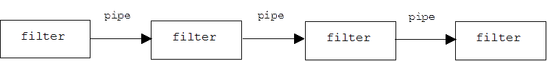
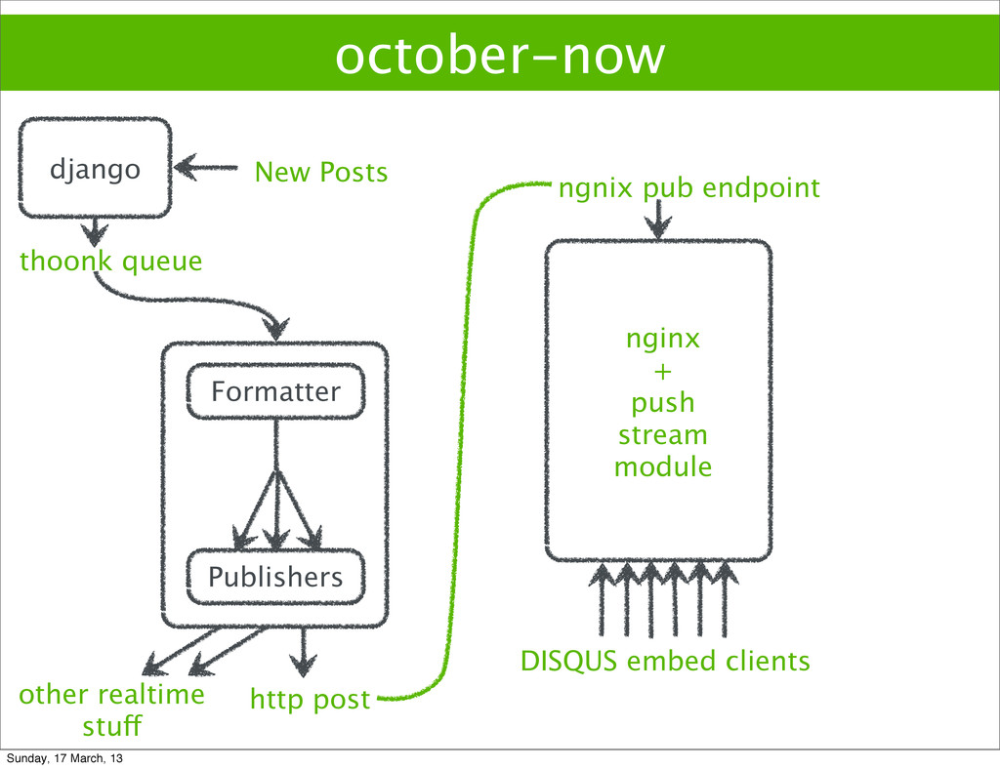

<!-- page_number: true -->
<!-- $size: 16:9 -->
<!-- $height: 1280px -->
<!-- $width: 1920px -->

<!-- $theme: gaia -->

# Getting the word out in ==realTime==

###### Building a message processing pipeline using Gevent, Redis and NginxPushStreamModule in Python

###### []


###### Created by [Rahul Gaur (@aregee)](https://github.com/aregee)

---

<!-- page_number: true -->
## Why do ==realTime==?


- getting new data to user asap.

- for increased engagement.

- reaching users even when they are not on your website

- realtime heatmaps and analysis of activity or engagement on post


---
<!-- *template: invert -->

>
> The **actor** model in computer science is a mathematical model of **concurrent computation** that treats **actors** as the universal primitives of concurrent computation.
>
> <small>-- *[Actor Model (computer science) - Wikipedia, the free encyclopedia](https://en.wikipedia.org/wiki/Actor_model)*</small>

---


## Actors


- The actor model is a higher level concurrency model popularized by the language Erlang.

- The idea is that you have a collection of independent Actors which have an inbox from which they receive messages from other Actors.

- The main loop inside the Actor iterates through its messages and takes action according to its desired behavior.


---


## How to implement an ==Actor== <br> using Gevent  !

##### *Gevent does not have a primitive Actor type, but we can define one very simply using a Queue inside of a subclassed Greenlet.*. :laughing:

---
<!-- $height: 18in -->

```python

import gevent
from gevent.queue import Queue

class Actor(gevent.Greenlet):
	def __init__(slef):
    	self.inbox = Queue()
    	Greenlet.__init__(self)
    def receive(self, message):
        """
        Define in your subclass.
        """
        raise NotImplemented()

    def _run(self):
        self.running = True

        while self.running:
            message = self.inbox.get()
            self.receive(message)

```


---
```python
import gevent
from gevent.queue import Queue
from gevent import Greenlet

class Pinger(Actor):
    def receive(self, message):
        print(message)
        pong.inbox.put('ping')
        gevent.sleep(0)

class Ponger(Actor):
    def receive(self, message):
        print(message)
        ping.inbox.put('pong')
        gevent.sleep(0)

ping = Pinger()
pong = Ponger()

ping.start()
pong.start()

ping.inbox.put('start')
gevent.joinall([ping, pong])

```
---
<!-- *template: gaia -->

## Architecture overview!!


---

# :yum:
---
<!-- *template: gaia -->

```
<!-- template: gaia -->
```


---
<!-- *template: invert -->
directive

---
<!-- template: gaia -->

# ==That's all!==

---


###### logo placeholder

#### https://github.com/aregee
